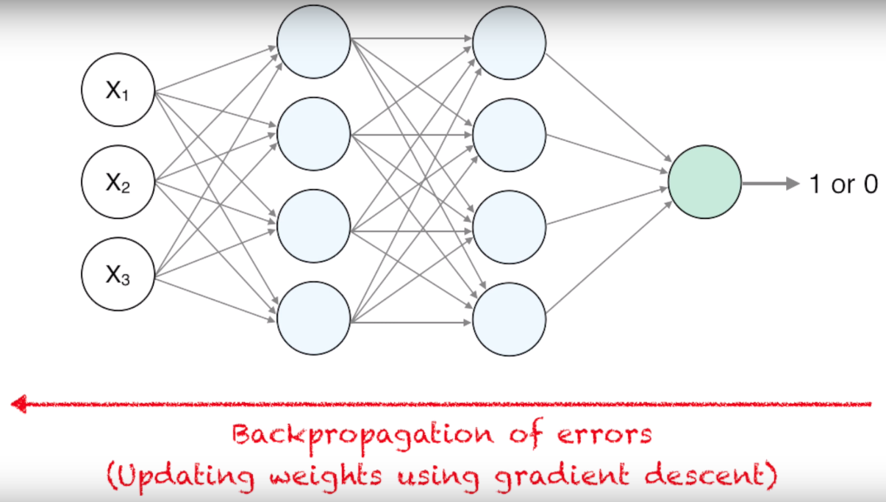
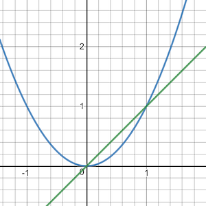

# Backpropgation

### [Backprogpation derivation detail](http://cpmarkchang.logdown.com/posts/277349-neural-network-backward-propagation)

### Basic idea

1. Derivative

    

    Blue line: 

    Green line: 

    <b>Formula:</b> 

2. Partial Derivative

    Original function: 

    Partial derivate with respect to `x`: 

    Partial derivate with respect to `y`: 

3. The Chain Rule

    If , then , what's it's derivative?
    
    The chain rule: 

    Result: 

<b>Formual:</b>

### References

* <a>http://cpmarkchang.logdown.com/posts/277349-neural-network-backward-propagation</a>
* <a>https://www.youtube.com/watch?v=q555kfIFUCM</a>